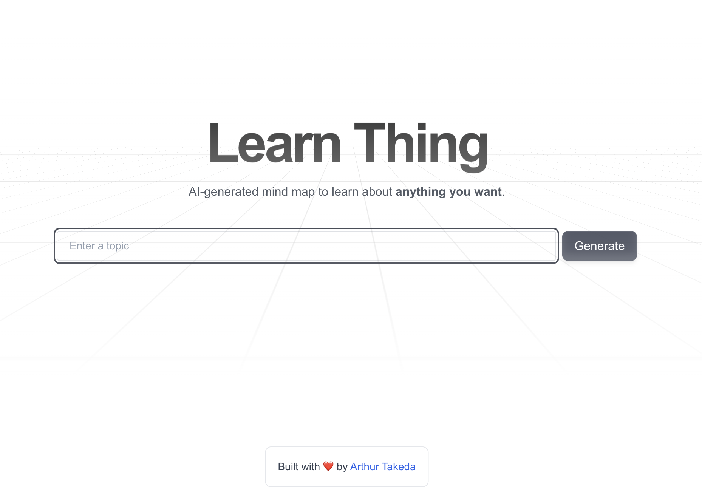

# Mind Map Visualization Project

This is a simple [Next.js](https://nextjs.org) project that implements a mind map visualization tool using [React Flow](https://reactflow.dev/).



The UI is built using [shadcn](https://ui.shadcn.com/) and some components from [Magic UI](https://magicui.design/).

It allows users to view and interact with mind maps, and download the mind map data as a markdown file.

The mind map data is generated using either local models from [Ollama](https://ollama.com/) or external models like [OpenAI](https://openai.com/) and leveraging [AI SDK](https://sdk.vercel.ai/docs/introduction).

## Features

- Interactive mind map visualization
- Node details view in a side sheet
- Markdown export functionality
- Save mind map data to a local JSON file
- Switch between local and external models

## Getting Started

Install all dependencies:

```bash
npm install
```

Copy the `.env.template` file to `.env.local` and specify which model (local or external) you want to use by setting the `NEXT_PUBLIC_USE_LOCAL_MODELS` environment variable to `true` or `false`.

When running an OpenAI model, you must specify your OpenAI API key in the `.env.local` file.

Inside the `route.ts` file, you must specify the model you are running using Ollama, by default it will use the `llama3.1` model for local models and for external models it will use the `gpt-3.5-turbo` model.

Bear in mind that external models tend to be much faster serving than local models.

If you want to learn how to run a model locally, check out the [Ollama documentation](https://github.com/ollama/ollama/blob/main/README.md#quickstart).

Now you're ready to run the development server:

```bash
npm run dev
```

Open [http://localhost:3000](http://localhost:3000) with your browser and then start creating your own learning mind maps.

## Prompts

The prompts used to generate the mind map data is defined in the `defaultLocalPrompt` and `defaultExternalPrompt` variables in the `prompts.ts` file.

## License

This project is licensed under the MIT License.
